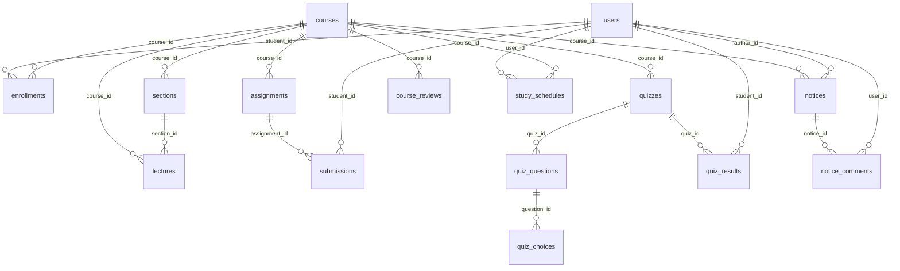

# CodePilot LMS ERD 설계서 (현재 구현 기준)

> 기준: 현재 프로젝트 코드/스키마 기준 실제 사용 테이블

---

## 1) 엔티티 목록

1. `users` (일반 사용자)
2. `business_users` (사업자 사용자)
3. `courses` (강의)
4. `enrollments` (수강신청)
5. `sections` (강의 섹션)
6. `lectures` (회차/학습목차)
7. `assignments` (과제)
8. `submissions` (과제 제출)
9. `quizzes` (퀴즈)
10. `quiz_questions` (퀴즈 문항)
11. `quiz_choices` (객관식 선택지)
12. `quiz_results` (퀴즈 결과)
13. `notices` (공지사항)
14. `notice_comments` (공지 댓글)
15. `course_reviews` (수강평)
16. `study_schedules` (학습 스케줄)

---

## 2) 관계 요약 (논리 관계)

- `enrollments.course_id` → `courses.id`
- `enrollments.student_id` → `users.id`

- `sections.course_id` → `courses.id`
- `lectures.course_id` → `courses.id`
- `lectures.section_id` → `sections.id` (nullable)

- `assignments.course_id` → `courses.id`
- `submissions.assignment_id` → `assignments.id`
- `submissions.student_id` → `users.id`

- `quizzes.course_id` → `courses.id`
- `quiz_questions.quiz_id` → `quizzes.id`
- `quiz_choices.question_id` → `quiz_questions.id`
- `quiz_results.quiz_id` → `quizzes.id`
- `quiz_results.student_id` → `users.id`

- `notices.course_id` → `courses.id` (nullable)
- `notices.author_id` → `users.id`
- `notice_comments.notice_id` → `notices.id`
- `notice_comments.user_id` → `users.id`

- `course_reviews.course_id` → `courses.id`
  - (`writer_name`는 문자열 저장, users FK 아님)

- `study_schedules.user_id` → `users.id`
- `study_schedules.course_id` → `courses.id`

> 참고: 일부는 컬럼 기반 논리 관계이며, 물리 FK 제약은 스키마에 명시되지 않은 부분이 있음.

---

## 3) 주요 유니크 제약

- `users.username` UNIQUE
- `users.email` UNIQUE
- `business_users.username` UNIQUE
- `business_users.email` UNIQUE
- `enrollments` UNIQUE (`course_id`, `student_id`)
- `submissions` UNIQUE (`assignment_id`, `student_id`)
- `quiz_results` UNIQUE (`quiz_id`, `student_id`)
- `study_schedules` UNIQUE (`user_id`, `course_id`)

---

## 4) Mermaid ERD

---

## 5) 도메인 메모

- `users`와 `business_users`는 로그인 계정을 분리 관리
- 수강 인원(`courses.purchase_count`)은 `enrollments` 수 기준 동기화
- 수강평 작성은 학습 진도 조건(20% 이상) 로직을 서비스/컨트롤러에서 제어
- 스케줄은 사용자별/강의별 1건 정책으로 관리 (`user_id`, `course_id`)
